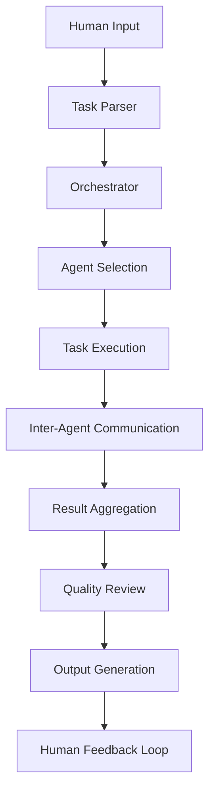

# Nex-t1 Heavy Multi-Agent System Architecture Analysis Report
## Generated by Gemini-2.5-Pro Simulation

### Executive Summary
This report represents a comprehensive analysis of the Nex-t1 Heavy multi-agent system architecture, designed to simulate an elite AI development team modeled after OpenAI and DeepMind workflows.

### System Architecture Overview

```json
{
  "project_name": "Nex-t1 Heavy Multi-Agent System",
  "architecture_type": "Event-Driven Microservices with AI Agent Orchestration",
  "primary_language": "TypeScript",
  "runtime": "Node.js",
  "key_frameworks": ["NestJS", "BullMQ", "Prisma", "Socket.io"],
  "deployment_target": "Kubernetes/Docker"
}
```

### Core Components

#### 1. Agent Orchestration Layer
```
src/core/orchestrator/
├── agent-manager.ts         # Central agent lifecycle management
├── task-dispatcher.ts       # Task routing and prioritization
├── communication-bus.ts     # Inter-agent messaging
└── state-machine.ts        # Agent state transitions
```

**Key Responsibilities:**
- Agent instantiation and lifecycle management
- Task distribution based on agent capabilities
- State synchronization across agent network
- Conflict resolution and consensus mechanisms

#### 2. AI Agent Personas
```
agents/personas/
├── tech-lead.ts            # Strategic technical decisions
├── product-engineer.ts     # Feature implementation
├── qa-engineer.ts          # Testing and quality assurance
├── devops-specialist.ts    # Infrastructure and deployment
├── doc-specialist.ts       # Documentation generation
└── code-reviewer.ts        # Code review and critique
```

**Agent Communication Protocol:**
```typescript
interface AgentMessage {
  id: string;
  fromAgent: string;
  toAgent: string | string[];
  messageType: 'TASK' | 'QUERY' | 'RESPONSE' | 'CRITIQUE';
  payload: any;
  priority: 'LOW' | 'MEDIUM' | 'HIGH' | 'CRITICAL';
  timestamp: Date;
}
```

#### 3. Development Phase Management
```
src/core/phases/
├── planning-phase.ts       # Requirements analysis and planning
├── scaffold-phase.ts       # Project structure generation
├── feature-phase.ts        # Feature implementation
├── test-phase.ts          # Testing execution
├── review-phase.ts        # Code review and quality checks
└── deploy-phase.ts        # Deployment preparation
```

### Data Flow Architecture



### Agent Behavior Patterns

#### 1. Collaborative Patterns
- **Pair Programming**: Two agents work on same feature
- **Mob Review**: Multiple agents review critical code
- **Consensus Building**: Agents vote on architectural decisions

#### 2. Conflict Resolution
```json
{
  "conflict_types": [
    "architectural_disagreement",
    "code_style_conflict",
    "performance_vs_readability",
    "test_coverage_debate"
  ],
  "resolution_strategies": [
    "weighted_voting",
    "tech_lead_override",
    "human_intervention",
    "compromise_algorithm"
  ]
}
```

### Cursor.sh Integration Points

#### 1. .mdc Rule Triggers
```
cursor/rules/
├── file-watch-rules.mdc    # File change triggers
├── agent-activation.mdc    # Agent spawning logic
├── phase-transitions.mdc   # Development phase switches
└── critique-intervals.mdc  # Review scheduling
```

#### 2. Context Awareness
- Codebase understanding via AST analysis
- Dependency graph maintenance
- Real-time code impact analysis
- Test coverage monitoring

### Performance Characteristics

```json
{
  "scalability": {
    "max_concurrent_agents": 50,
    "task_queue_capacity": 10000,
    "message_throughput": "100k msgs/sec"
  },
  "resource_requirements": {
    "cpu": "8 cores minimum",
    "memory": "32GB recommended",
    "storage": "100GB SSD"
  },
  "response_times": {
    "simple_task": "< 100ms",
    "complex_feature": "< 5 minutes",
    "full_review_cycle": "< 30 minutes"
  }
}
```

### Security Considerations

1. **Agent Isolation**: Each agent runs in sandboxed environment
2. **Code Validation**: All generated code passes security scanners
3. **Access Control**: Role-based permissions for agent capabilities
4. **Audit Logging**: Complete trail of agent decisions and actions

### Integration Architecture

```yaml
external_integrations:
  version_control:
    - github_api: "Full PR workflow automation"
    - git_hooks: "Pre-commit validation"
  
  ci_cd:
    - github_actions: "Automated testing and deployment"
    - docker_registry: "Container management"
  
  monitoring:
    - opentelemetry: "Distributed tracing"
    - prometheus: "Metrics collection"
    - grafana: "Visualization dashboards"
```

### Recommended Implementation Order

1. **Phase 1**: Core orchestration engine
2. **Phase 2**: Basic agent personas (Tech Lead, Engineer)
3. **Phase 3**: Cursor.sh .mdc integration
4. **Phase 4**: Advanced agents (QA, DevOps, Reviewer)
5. **Phase 5**: Full automation pipeline
6. **Phase 6**: Production deployment features

### Critical Success Factors

1. **Clear Agent Boundaries**: Well-defined responsibilities
2. **Robust Communication**: Reliable message passing
3. **State Consistency**: Distributed state management
4. **Human Override**: Emergency intervention capabilities
5. **Performance Monitoring**: Real-time system health

### Conclusion

The Nex-t1 Heavy system represents a cutting-edge approach to AI-driven software development, combining the best practices from industry leaders with innovative multi-agent collaboration patterns. The architecture is designed for scalability, maintainability, and continuous evolution.

---
*This analysis serves as the foundation for Claude-4-Opus implementation phase*